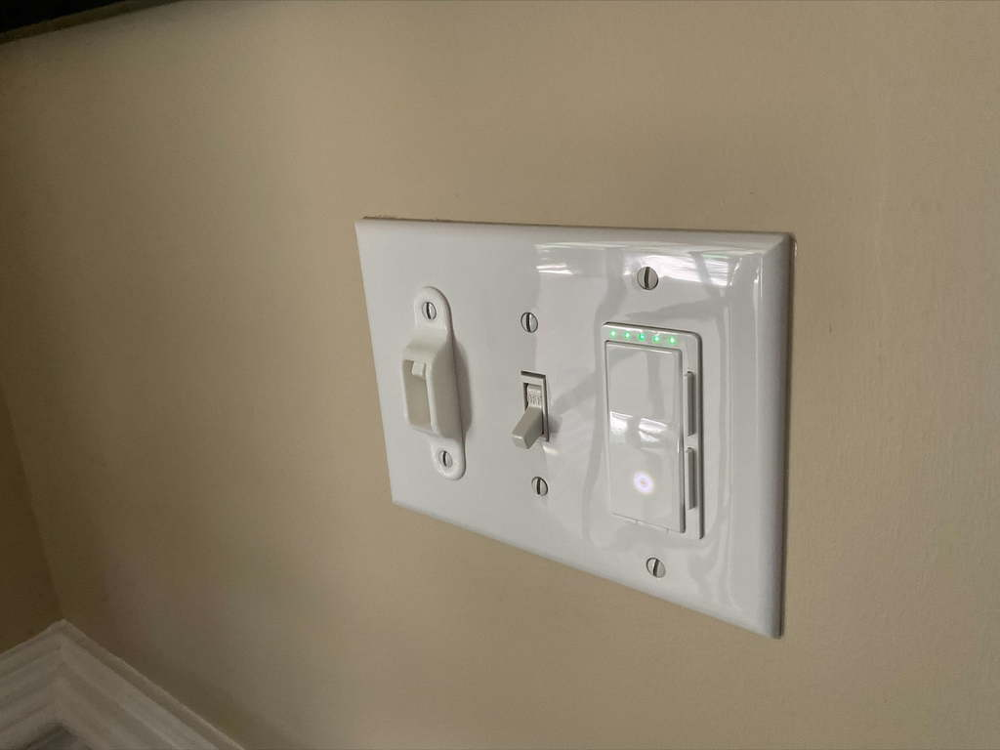

# fusion-projects

Will Patti's Fusion360 Projects

## Projects

### [Light Switch Cover](projects/light-switch-cover/README.md)
A sleek cover that prevents accidental switching by adding subtle resistance. 

 

### [Garage Door Opener Holder](projects/garage-door-opener-holder/README.md)
A wall-mounted holder that securely fits your LiftMaster opener remote for easy access.  

### [Automatic Fish Feeder](projects/fish-feeder/README.md)
An automated dispenser designed to feed your fish on a regular schedule with minimal fuss.  

### [Apple Charger Protectors](projects/charger-protector/README.md)
A precisely engineered protector that prevents cord fraying while ensuring a snug fit for your charger. 
 

