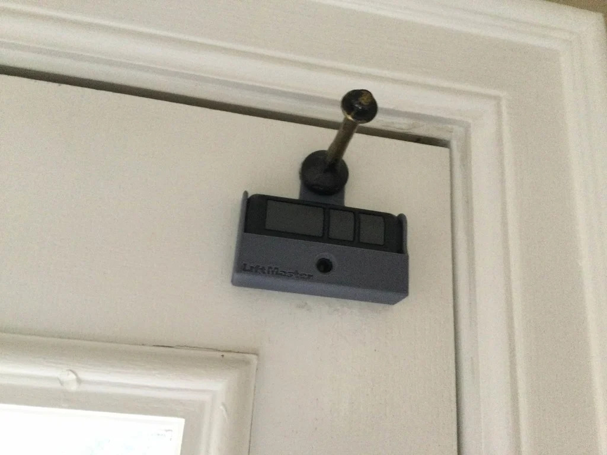

# LiftMaster 893LM Garage Door Opener Holder

[Thingiverse URL](https://www.thingiverse.com/thing:4736228)

This is a holder for the LiftMaster 893LM garage door opener remote. It is designed to be mounted to a wall/door commonly used when accessing the garage. The remote is held in place by a friction fit and can be easily removed when needed. Attach with a ~5mm screw or double sided tape.

