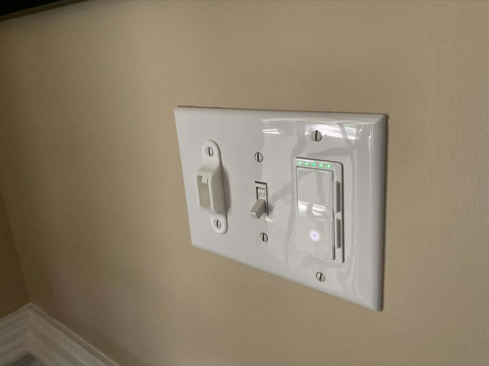

# Sleek Light Switch Cover - Stops unwanted switching

[Thingiverse URL](https://www.thingiverse.com/thing:4950004)

Keep trying to charge a device on a random outlet that seems to not work until you flip the switch on the other side of the room?

 This 30 minute print will stop unwanted switching of light switches that control important devices, such as smart LEDs, smart plugs, routers, and more. If you still want to use the switch, all you have to do is put your finger in and switch like normal. This print adds a bit of resistance to the switch, making it harder to switch on and off accidentally.

 
 